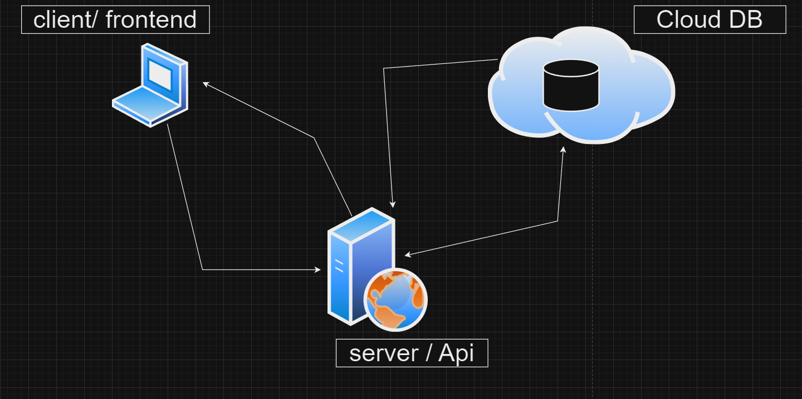
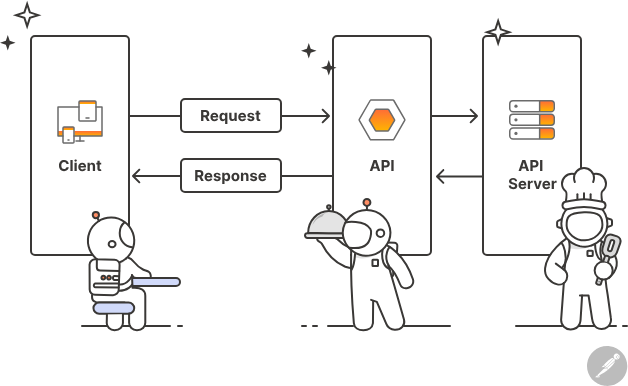

# Understanding Server, Backend, and API Calls

## Table of Contents
- [Overview](#overview)
- [Server](#server)
- [Backend](#backend)
- [API Calls](#api-calls)
- [System Design Diagram](#system-design-diagram)
- [Example Code](#example-code)

## Overview
This document provides a basic understanding of servers, backends, and API calls, along with a simple example project using the MERN stack (MongoDB, Express, React, Node.js).

## Server
A **server** is a computer or system that provides data, resources, services, or programs to other computers, known as clients, over a network.

### Key Points
- **Hosting**: Servers can host websites, APIs, databases, and more.
- **Listening**: Servers listen for client requests on a specific port (e.g., HTTP requests on port 80).
- **Response**: Servers process requests and send back responses.

### Diagram


## Backend
The **backend** refers to the server-side part of a web application. It includes:
- **Server**: Runs the application and handles client requests.
- **Database**: Stores data for the application.
- **API**: Allows the frontend to communicate with the backend.

### Key Points
- **Business Logic**: Contains the core logic and rules of the application.
- **Data Management**: Interacts with the database to store and retrieve data.
- **Security**: Manages authentication, authorization, and data validation.


## API Calls
An **API (Application Programming Interface)** allows different software applications to communicate with each other. In web development, APIs are often used to enable the frontend to interact with the backend.

### Key Points
- **HTTP Methods**: Common methods include GET (retrieve data), POST (submit data), PUT (update data), and DELETE (remove data).
- **Endpoints**: URLs where APIs can be accessed (e.g., `/api/todos`).
- **Request/Response**: Clients send requests to API endpoints, and the server responds with data.


## System Design Diagram
This diagram shows how the server, backend, and API interact in a MERN stack application.


### Explanation
1. **Client (React)**: Sends HTTP requests to the server.
2. **Server (Node.js/Express)**: Receives requests, processes them, and interacts with the database.
3. **Database (MongoDB)**: Stores and retrieves data as needed.
4. **API (Express Routes)**: Defines endpoints that handle specific operations (e.g., CRUD operations for todos).

## Example Code
### Server Setup (Node.js/Express)
```javascript
import express from "express";
import mongoose from "mongoose";
const app = express();

app.use(express.json());


const port = 5500;
const mongoUrl = "mongodb://127.0.0.1/sampleServer";

mongoose
  .connect(mongoUrl)
  .then(() => app.listen(port))
  .then(() =>
    console.log(`⚙️  Server is running and connected to db at port ${port} :)`)
  )
  .catch((err) => console.log(`${err} is error`));
```




